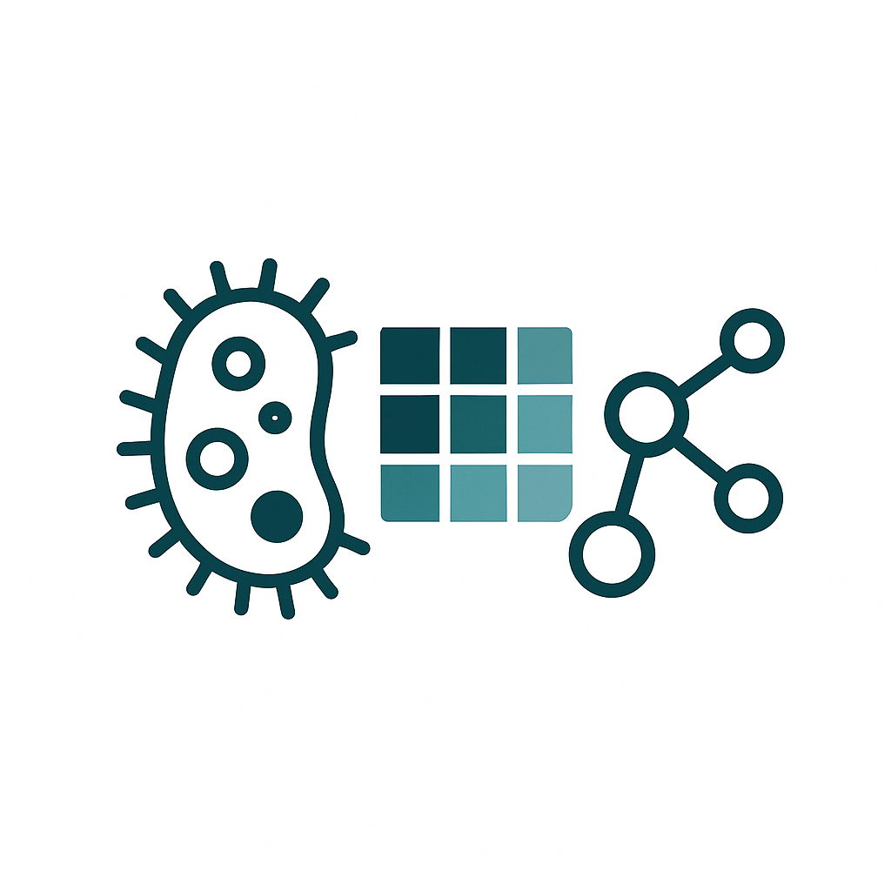

# CZID-ONT-microbiome



An interactive **Shiny** application to explore *Sample Taxon Report* CSV files (one per barcode) generated from the [CZID](https://czid.org/) **ONT metagenomic pipeline**.

## Table of Contents

1. [Features](#features)
2. [Requirements](#requirements)
3. [Installation](#installation)
4. [Data Format & File Naming](#data-format--file-naming)
5. [Launching the App](#launching-the-app)
6. [Interface Usage](#interface-usage)
7. [Export Options](#export-options)
9. [Acknowledgements](#acknowledgements)

---

## Features

* **Metadata preview**: quick inspection of the metadata file.
* **CZID report preview**: check content of each uploaded taxon report.
* **Heatmap visualization**: taxon × sample heatmaps based on selected metrics.
* **Alpha diversity**: calculates and visualizes Shannon, Simpson, or Richness indexes.
* **PCoA analysis**: 2D ordination using Bray-Curtis distances with optional centroids/ellipses.
* **Stacked barplots**: relative abundances per sample with grouping/faceting options.
* **Downloads**: each plot is exportable (PDF/PNG).

## Requirements

| Software | Version   | Notes                     |
| -------- | --------- | ------------------------- |
| R        | ≥ 4.1     | Tested with R 4.3+        |
| RStudio  | ≥ 2022.07 | Optional, for convenience |

### R Packages

Install required packages via:

```r
install.packages(c(
  "shiny", "dplyr", "tidyr", "pheatmap", "vegan",
  "ggplot2", "plotly", "tools", "viridis"
))
```

## Installation

1. Clone or download this repository:

   ```bash
   git clone https://github.com/<your-org>/czid-ont-microbiome.git
   cd czid-ont-microbiome
   ```
2. Install the R package dependencies (see above).


### Metadata file (CSV)

Required columns:

| Column     | Description                                                            |
| ---------- | ---------------------------------------------------------------------- |
| `sample`   | Matches the report filename prefix (i.e., without `_taxon_report.csv`) |
| `sampleid` | Display name or readable identifier for the sample                     |

Optional columns can include grouping variables (e.g., `site`, `treatment`, `date`, etc.).

### CZID Reports

* Format: CSV files from CZID *Sample Taxon Reports*.
* File naming pattern: `<sample>_taxon_report.csv`

## Launching the App

From within R or RStudio:

```r
shiny::runApp("app.R", launch.browser = TRUE)
```

## Interface Usage

1. **Load metadata** file first.
2. **Upload all** your CZID taxon reports (`*_taxon_report.csv`).
3. Navigate across the tabs:

   * *Metadata Preview* – verify metadata content.
   * *Report Preview* – spot-check loaded taxon reports.
   * *Heatmap* – select filters, clustering, log transform, top taxa.
   * *Alpha Diversity* – select diversity index and grouping.
   * *PCoA* – customize visuals and add centroids/segments/ellipses.
   * *Stacked Bar* – configure number of taxa, grouping, categories.

### Heatmap Settings

| Parameter       | Description                                      |
| --------------- | ------------------------------------------------ |
| Metric          | `nt_bpm`, `nr_bpm`, `nt_contig_b`, `nr_contig_b` |
| Taxonomic Level | 1 = species, 2 = genus                           |
| Categories      | Filter by `viruses`, `bacteria`, etc.            |
| Min thresholds  | Minimum bpm or contig values to include          |
| Top N taxa      | Number of taxa to display                        |
| Log2 transform  | Apply log2(x+1) transformation                   |

## Export Options

Each analysis tab provides a **Download** button:

* Heatmap → `PDF`
* Alpha Diversity, PCoA, Stacked Bar → `PNG`

Filenames include the export date.

## Acknowledgements

* [CZID](https://czid.org/) for providing the analytical platform.
* R packages used: *shiny*, *dplyr*, *tidyr*, *pheatmap*, *vegan*, *ggplot2*, *plotly*, *viridis*.

---

## License

This project is licensed under the MIT License. See the [LICENSE](LICENSE) file for details.

[

---

## Contact / Assistance

If you need help, have questions, or want to report an issue, please contact:

> **Théo Ghelfenstein-Ferreira**
> Email: [theo.ferreira@aphp.fr](mailto:theo.ferreira@aphp.fr)

Feel free to reach out for assistance with installation, data formatting, or troubleshooting.

